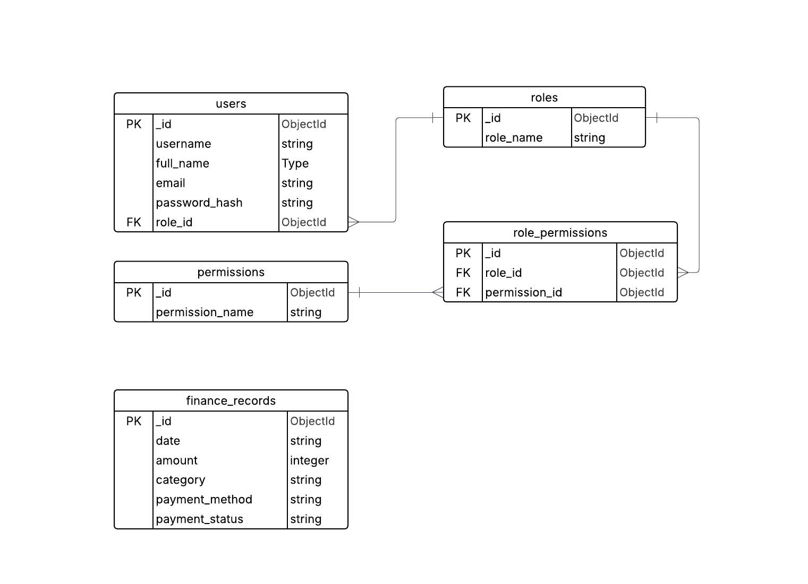

## Table of Contents

- [How to run this project](#how-to-run-this-project)
- [Features](#features)
- [Technologies](#technologies)
- [Getting Started](#getting-started)
- [API Documentation](#api-documentation)
  - [Authentication Flow](#authentication-flow)
  - [Role Management](#role-management)
  - [Permission Management](#permission-management)
  - [Role-Permission Assignment](#role-permission-assignment)
- [RBAC Demonstration](#rbac-demonstration)

## How to run this project

### Requirements

- Node v20
- npm v11

### Setup Instructions

1. Clone the project:

   `git clone https://github.com/Pushkarcdn/rbac-demo-with-express.git`

2. Go to to the project's root directory

   `cd rbac-demo-with-express`

3. Copy the env file at project root

4. Install dependencies using:

   `npm install`

5. Start the server using:

   `npm run dev:local`

6. The backend can be accessed at http://localhost:4000 (port can be changed through env file)

## Auth Features

- User authentication (register, login)
- Role-based access control
- Permission-based authorization
- JWT authentication using cookies\

## Technologies

- Node.js
- Express.js
- MongoDB with Mongoose
- JWT for authentication
- bcrypt for password hashing

## Database Schema



## API Documentation

### Authentication Flow

The authentication flow consists of the following steps:

1. **Create a Role**: First, create a role that will be assigned to users
2. **Register a User**: Register using a specific role (including role_id in body)
3. **Login**: Authenticate the user and receive an access token
4. **Access Protected Resources**: Use the access token to access protected resources
5. **Create Permissions**: Create permissions for specific actions
6. **Assign Permissions to Roles**: Link permissions to roles using the role_permissions table
7. **Access the Protected Data**: Try to access the data that is protected and requires specific role

### Api base url:

```json
"https://rbac-demo.pushkar.live"
```

#### 1. Create a Role

Before registering users, we need to create at least one role.

**Endpoint:** `POST /api/roles`

**Request Body:**

```json
{
  "role_name": "Employee"
}
```

**Response:**

```json
{
  "success": true,
  "message": "Role created successfully!",
  "data": {
    "_id": "65f8a7b3c4e9a8d7b6c5a4b3",
    "role_name": "user",
    "createdAt": "2023-09-18T10:30:45.123Z",
    "updatedAt": "2023-09-18T10:30:45.123Z"
  },
  "source": "roles"
}
```

#### 2. Register a User

**Endpoint:** `POST /api/auth/register`

**Request Body:**

```json
{
  "username": "johndoe",
  "full_name": "John Doe",
  "email": "john@example.com",
  "password": "securepassword123",
  "role_id": "65f8a7b3c4e9a8d7b6c5a4b3"
}
```

**Response:**

```json
{
  "success": true,
  "message": "Signup successful!",
  "data": {},
  "source": "register"
}
```

#### 3. Login

**Endpoint:** `POST /api/auth/login`

**Request Body:**

```json
{
  "email": "john@example.com",
  "password": "securepassword123"
}
```

**Response:**

```json
{
  "success": true,
  "message": "Signin successful!",
  "data": {},
  "source": "login"
}
```

This endpoint sets an HTTP-only & secure cookie containing the JWT access token.

#### 4. Get Current User Details

**Endpoint:** `GET /api/auth/me`

**Headers:**
The JWT token is automatically sent via cookies, so no additional headers are required.

**Response:**

```json
{
  "success": true,
  "message": "User fetched successfully!",
  "data": {
    "_id": "65f8a7b3c4e9a8d7b6c5a4b3",
    "username": "johndoe",
    "full_name": "John Doe",
    "email": "john@example.com",
    "role_id": "65f8a7b3c4e9a8d7b6c5a4b3",
    "createdAt": "2023-09-18T10:30:45.123Z",
    "updatedAt": "2023-09-18T10:30:45.123Z"
  },
  "source": "me"
}
```

### Role Management

#### List All Roles

**Endpoint:** `GET /api/roles`

**Response:**

```json
{
  "success": true,
  "message": "Roles fetched successfully!",
  "data": [
    {
      "_id": "65f8a7b3c4e9a8d7b6c5a4b3",
      "role_name": "Employee",
      "createdAt": "2023-09-18T10:30:45.123Z",
      "updatedAt": "2023-09-18T10:30:45.123Z"
    },
    {
      "_id": "65f8a7b3c4e9a8d7b6c5a4b4",
      "role_name": "Manager",
      "createdAt": "2023-09-18T10:30:45.123Z",
      "updatedAt": "2023-09-18T10:30:45.123Z"
    }
  ]
}
```

### Permission Management

#### 5. Create Permissions

**Endpoint:** `POST /api/permissions`

**Request Body:**

```json
{
  "permission_name": "create_finance_record"
}
```

**Response:**

```json
{
  "success": true,
  "message": "Permission created successfully!",
  "data": {
    "_id": "65f8a7b3c4e9a8d7b6c5a4b5",
    "permission_name": "create_finance_record",
    "createdAt": "2023-09-18T10:30:45.123Z",
    "updatedAt": "2023-09-18T10:30:45.123Z"
  }
}
```

#### List All Permissions

**Endpoint:** `GET /api/permissions`

**Response:**

```json
{
  "success": true,
  "message": "Permissions fetched successfully!",
  "data": [
    {
      "_id": "65f8a7b3c4e9a8d7b6c5a4b5",
      "permission_name": "create_finance_record",
      "createdAt": "2023-09-18T10:30:45.123Z",
      "updatedAt": "2023-09-18T10:30:45.123Z"
    },
    {
      "_id": "65f8a7b3c4e9a8d7b6c5a4b6",
      "permission_name": "delete_finance_record",
      "createdAt": "2023-09-18T10:30:45.123Z",
      "updatedAt": "2023-09-18T10:30:45.123Z"
    }
  ]
}
```

### Role-Permission Assignment

#### 6. Assign Permissions to Roles

**Endpoint:** `POST /api/role-permissions`

**Request Body:**

```json
{
  "role_id": "65f8a7b3c4e9a8d7b6c5a4b3",
  "permission_id": "65f8a7b3c4e9a8d7b6c5a4b5"
}
```

**Response:**

```json
{
  "success": true,
  "message": "Role permission created successfully!",
  "data": {
    "_id": "65f8a7b3c4e9a8d7b6c5a4b7",
    "role_id": "65f8a7b3c4e9a8d7b6c5a4b3",
    "permission_id": "65f8a7b3c4e9a8d7b6c5a4b5",
    "createdAt": "2023-09-18T10:30:45.123Z",
    "updatedAt": "2023-09-18T10:30:45.123Z"
  },
  "source": "role-permissions"
}
```

#### List All Role-Permission Assignments

**Endpoint:** `GET /api/role-permissions`

**Response:**

```json
{
  "success": true,
  "message": "Role permissions fetched successfully!",
  "data": [
    {
      "_id": "65f8a7b3c4e9a8d7b6c5a4b7",
      "role_id": "65f8a7b3c4e9a8d7b6c5a4b3",
      "permission_id": "65f8a7b3c4e9a8d7b6c5a4b5",
      "createdAt": "2023-09-18T10:30:45.123Z",
      "updatedAt": "2023-09-18T10:30:45.123Z"
    }
  ],
  "source": "role-permissions"
}
```

## Authorization Flow

1. Create a role using the `/api/roles` endpoint
2. Register a user with the role using the `/api/auth/register` endpoint
3. Create permissions using the `/api/permissions` endpoint
4. Assign permissions to roles using the `/api/role-permissions` endpoint
5. Login with the user credentials using the `/api/auth/login` endpoint
6. Access protected resources using the JWT token (automatically sent via cookies)
7. Check user details using the `/api/auth/me` endpoint

## RBAC Demonstration

This section demonstrates how Role-Based Access Control (RBAC) is implemented for the Finance Records API endpoints. The system has currently three roles (Employee, Manager, and Admin) with different permissions.

### Role and Permission Matrix

| Role     | Permissions                                |
| -------- | ------------------------------------------ |
| Employee | view_finance_record, create_finance_record |
| Manager  | view_finance_record, edit_finance_record   |
| Admin    | view_finance_record, delete_finance_record |

### Finance Records API Endpoints

#### View Finance Records (All Roles)

All roles (Employee, Manager, Admin) can access this endpoint:

**Endpoint:** `GET /api/finance-records`

**Required Permission:** `view_finance_record`

**Response:**

```json
{
  "success": true,
  "message": "Finance records fetched successfully!",
  "data": [
    {
      "_id": "65f8a7b3c4e9a8d7b6c5a4b8",
      "date": "2025-02-02T00:00:00.000Z",
      "amount": 200000,
      "category": "Salary",
      "payment_method": "Cash",
      "createdAt": "2023-09-18T10:30:45.123Z",
      "updatedAt": "2023-09-18T10:30:45.123Z"
    }
  ],
  "source": "finance_records"
}
```

#### Create Finance Record (Employee)

Only users with the Employee role can create new finance records:

**Endpoint:** `POST /api/finance-records`

**Required Permission:** `create_finance_record`

**Request Body:**

```json
{
  "amount": 200000,
  "category": "salary",
  "payment_method": "Cash"
}
```

**Response:**

```json
{
  "success": true,
  "message": "Finance record created successfully!",
  "data": {
    "_id": "65f8a7b3c4e9a8d7b6c5a4b8",
    "date": "2025-02-02",
    "amount": 200000,
    "category": "Salary",
    "payment_method": "Cash",
    "payment_status": "Completed",
    "createdAt": "2023-09-18T10:30:45.123Z",
    "updatedAt": "2023-09-18T10:30:45.123Z"
  },
  "source": "finance_records"
}
```

#### Update Finance Record (Manager)

Only users with the Manager role can update existing finance records:

**Endpoint:** `PUT /api/finance-records/:id`

**Required Permission:** `edit_finance_record`

**Request Body:**

```json
{
  "amount": 1500
}
```

**Response:**

```json
{
  "success": true,
  "message": "Finance record updated successfully!",
  "data": {
    "_id": "65f8a7b3c4e9a8d7b6c5a4b8",
    "amount": 1500,
    "createdAt": "2023-09-18T10:30:45.123Z",
    "updatedAt": "2023-09-18T10:31:15.456Z"
  },
  "source": "finance_records"
}
```

#### Delete Finance Record (Admin)

Only users with the Admin role can delete finance records:

**Endpoint:** `DELETE /api/finance-records/:id`

**Required Permission:** `delete_finance_record`

**Response:**

```json
{
  "success": true,
  "message": "Finance record deleted successfully!",
  "data": {},
  "source": "finance_records"
}
```

### Setting Up RBAC for Finance Records

1. Create the three roles (Employee, Manager, Admin):

   ```
   POST /api/roles { "role_name": "Employee" }

   POST /api/roles { "role_name": "Manager" }

   POST /api/roles { "role_name": "Admin" }
   ```

2. Create the required permissions:

   ```
   POST /api/permissions { "permission_name": "view_finance_record" }

   POST /api/permissions { "permission_name": "create_finance_record" }

   POST /api/permissions { "permission_name": "edit_finance_record" }

   POST /api/permissions { "permission_name": "delete_finance_record" }
   ```

3. Assign permissions to roles:

   ```
   # Employee permissions

   POST /api/role-permissions { "role_id": "employee_role_id", "permission_id": "view_finance_record_id" }

   POST /api/role-permissions { "role_id": "employee_role_id", "permission_id": "create_finance_record_id" }


   # Manager permissions

   POST /api/role-permissions { "role_id": "manager_role_id", "permission_id": "view_finance_record_id" }

   POST /api/role-permissions { "role_id": "manager_role_id", "permission_id": "edit_finance_record_id" }


   # Admin permissions

   POST /api/role-permissions { "role_id": "admin_role_id", "permission_id": "view_finance_record_id" }

   POST /api/role-permissions { "role_id": "admin_role_id", "permission_id": "delete_finance_record_id" }
   ```

4. We can register users with different roles and test access to the finance records endpoints.
